---
## Front matter
lang: ru-RU
title: Лабораторная 1
subtitle: Простейший шаблон
author:
 Коннова Т. А.
institute:
  - Российский университет дружбы народов, Москва, Россия
  
date: 18 фев 2023

## i18n babel
babel-lang: russian
babel-otherlangs: english

## Formatting pdf
toc: false
toc-title: Содержание
slide_level: 2
aspectratio: 169
section-titles: true
theme: metropolis
header-includes:
 - \metroset{progressbar=frametitle,sectionpage=progressbar,numbering=fraction}
 - '\makeatletter'
 - '\beamer@ignorenonframefalse'
 - '\makeatother'
---

# Информация

## Докладчик

:::::::::::::: {.columns align=center}
::: {.column width="70%"}

  * Коннова Т. А.
  * Российский университет дружбы народов


:::
::: {.column width="30%"}


:::
::::::::::::::


Так как в первом семестре наша группа устанавливала виртуальную машину и ряд дистрибутивов, то в этой лабораторной работе я предполагаю взятие скринов именно из моей первосеместровой работы.
Начинаем устанавливать виртуальную машину 
1) Установка VirtualBox. Так как дальнейшие лабораторные работы будут
производиться мною на своем компьютере, то я устанавливаю виртуальную машину,
чтобы в последующем установить на нее OS Linux. 

{ #fig:001 width=10% }


{ #fig:002 width=10% }


{ #fig:003 width=10% }
 
Для того, чтобы соблюсти соглашение об именовании, мы создаем
необходимую подпапку с именем студента. Так как планируемый дистрибутив
для Linux— Fedora, его и выбираем. 

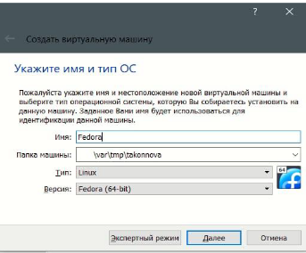{ #fig:004 width=10% }


Выбираем объем памяти, а также создаем новый виртуальный жесткий диск 
  
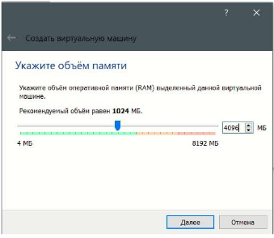{ #fig:005 width=10% }


{ #fig:006 width=10% }


Выбираем тип VDI 

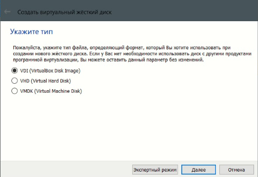{ #fig:007 width=10% }

Выбираем формат хранения 

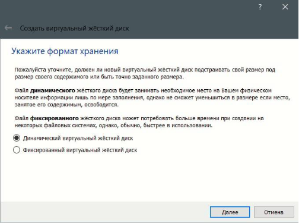{ #fig:008 width=10% }

Увеличиваем объем видеопамяти до 128МБ 

{ #fig:009 width=10% }


На данном этапе выбираем необходимый размер файла — 80 ГБ, задаем ему имя.

{ #fig:011 width=10% }   


## 3) Установка дистрибутива Fedora 36

Скачиваем с сайта https://getfedora.org/ru/workstation/download/ образ 

{ #fig:111 width=10% }


Меняем виртуальный оптический привод, выставляем вторичное устройство,
проверяем его папку 
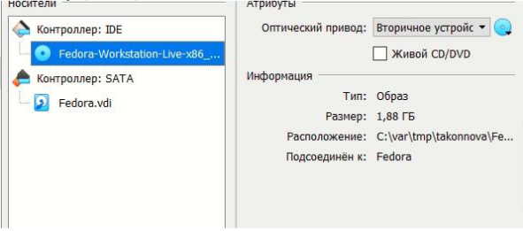{ #fig:012 width=10% }

Меняем хост-клавишу на комбинацию левый Ctrl+ левый Alt 

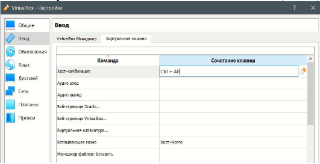{ #fig:013 width=10% }


Наконец, запускаем Fedora-36 

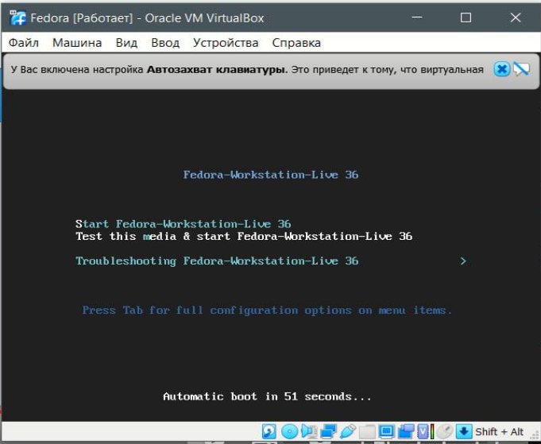{ #fig:014 width=10% }  


Так как метод, описанный в конспекте лабораторной работы у меня не
получился(возможно, из-за разницы методик версий), я изъяла оптический привод до
того, как начать работу с Fedora, а затем перезапустила Fedora 

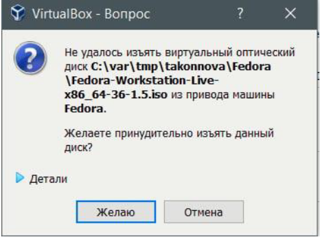{ #fig:067 width=10% }

Меняем язык настроек, место установки автоматически, предлагаемый диск нас
устраивает. 

{ #fig:015 width=10% } 

Fedora готова к работе 

{ #fig:016 width=10% }  


Перезапускаем Fedora 

{ #fig:017 width=10% } 

Оставляем настройки конфиденциальности без изменени 


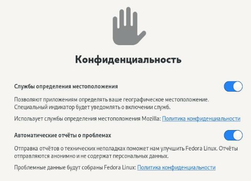{ #fig:019 width=10% }


Настраиваем пароль, подтверждаем его


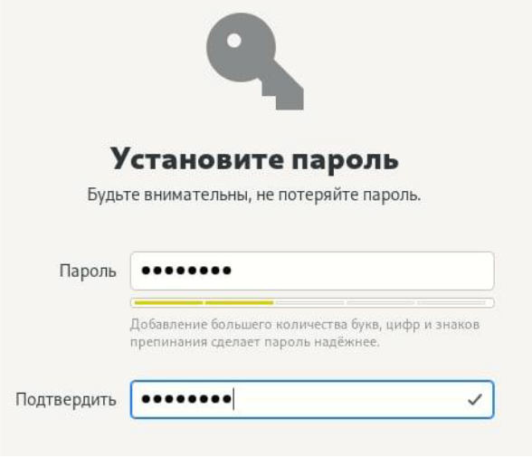{ #fig:020 width=70% }

Fedora готова к работе


{ #fig:021 width=70% }


{ #fig:001 width=70% }{ #fig:022 width=70% }


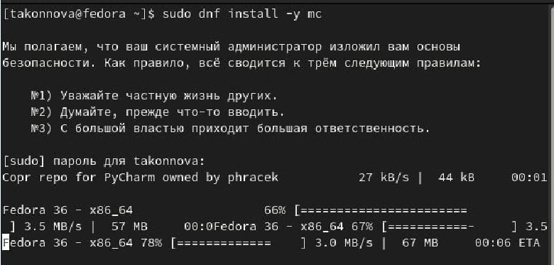{ #fig:023 width=70% }


{ #fig:024 width=70% }


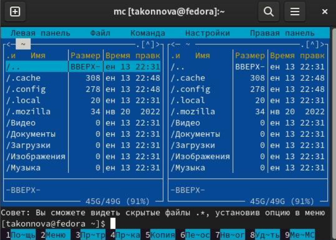{ #fig:025 width=70% }


{ #fig:026 width=70% }


{ #fig:027 width=70% }


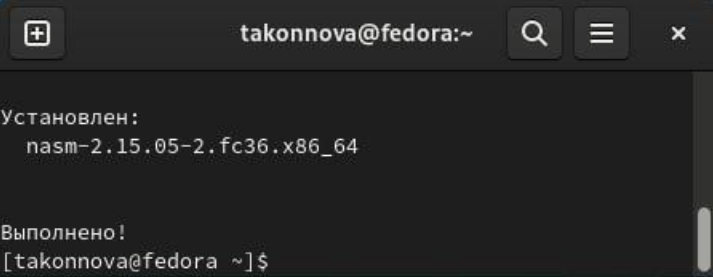{ #fig:028 width=70% } 


Установим pandoc and texlive(он установлен в ходе выполнения первосеместровой лабораторной номер 1)
    Запускаем терминальный мультиплексор tmux:

    tmux

    Переключитесь на роль супер-пользователя:

    sudo -i

рandoc

    Установим pandoc:

         dnf -y install pandoc

    Установим необходимые расширения(ошибка, возникшая у меня из-за невыполнения этой команды ранее):

        pip install pandoc-fignos pandoc-eqnos pandoc-tablenos pandoc-secnos --user
    
 
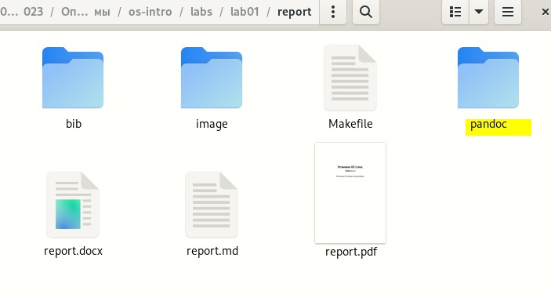{ #fig:030 width=70% }  
    

texlive

    Установим дистрибутив TeXlive:

            dnf -y install texlive texlive


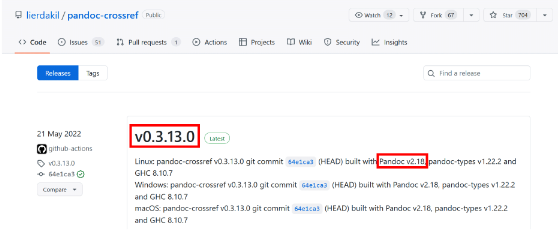{ #fig:029 width=70% }  


## Самостоятельная работа 
ОТВЕТЫ НА ДОМАШНЕЕ ЗАДАНИЕ И ВОПРОСЫ:


1)
    Какую информацию содержит учётная запись пользователя?
    
    
    Логин и пароль
    
    
2)
    Укажите команды терминала и приведите примеры:
для получения справки по команде;


       -help 
       
       
пример:


    wget -help
    
    
для перемещения по файловой системе;


       cd 
       
       
пример:


       cd /home
       
        
для просмотра содержимого каталога;


       ls /takonnova
       
       
        
для определения объёма каталога;


       du
       
       
пример:


       sudo du -h /home
       
       
для создания / удаления каталогов / файлов;
       
       
создание файла


       touch
       
       
пример:


       touch ~/folder/rsm.txt
       
       
создание папки


    mkdir
    
    
пример:


    mkdir ~/folder2345/fokder_new_gu
    
    
    
    
удалить файл


    rm 
    
    
пример:


    rm ~/fokl/gfi.txt
    
    
удалить папку


    rm -r
    
    
пример:


    rm -r ~/fghj/tyhtr.txt
    
    
для задания определённых прав на файл / каталог;


    chmod 
    
    
пример:


    chmod d-w fikrijvfghjb.txt
    
    
для просмотра истории команд.


    history

3)Что такое файловая система? Приведите примеры с краткой характеристикой.


    Файловая система -  часть операционной системы, обеспечивающая запись и чтение файлов на дисковых носителях. Пример это FAT, NFTS for Windows,  Extended Filesystem for Linux.
    
    
4)Как посмотреть, какие файловые системы подмонтированы в ОС?


    findmnt
    
    
5)Как удалить зависший процесс?

    kill 


# Выводы
Мы приобрели практические навыки установки операционной системы на виртуальную машину, сделали настройки минимально необходимых для дальнейшей работы сервисов.

# Вводная часть

## Актуальность

- Важно донести результаты своих исследований до окружающих
- Научная презентация --- рабочий инструмент исследователя
- Необходимо создавать презентацию быстро
- Желательна минимизация усилий для создания презентации

## Объект и предмет исследования

- Презентация как текст
- Программное обеспечение для создания презентаций
- Входные и выходные форматы презентаций

## Цели и задачи

- Создать шаблон презентации в Markdown
- Описать алгоритм создания выходных форматов презентаций

## Материалы и методы

- Процессор `pandoc` для входного формата Markdown
- Результирующие форматы
	- `pdf`
	- `html`
- Автоматизация процесса создания: `Makefile`

# Создание презентации

## Процессор `pandoc`

- Pandoc: преобразователь текстовых файлов
- Сайт: <https://pandoc.org/>
- Репозиторий: <https://github.com/jgm/pandoc>

## Формат `pdf`

- Использование LaTeX
- Пакет для презентации: [beamer](https://ctan.org/pkg/beamer)
- Тема оформления: `metropolis`

## Код для формата `pdf`

```yaml
slide_level: 2
aspectratio: 169
section-titles: true
theme: metropolis
```

## Формат `html`

- Используется фреймворк [reveal.js](https://revealjs.com/)
- Используется [тема](https://revealjs.com/themes/) `beige`

## Код для формата `html`

- Тема задаётся в файле `Makefile`

```make
REVEALJS_THEME = beige 
```
# Результаты

## Получающиеся форматы

- Полученный `pdf`-файл можно демонстрировать в любой программе просмотра `pdf`
- Полученный `html`-файл содержит в себе все ресурсы: изображения, css, скрипты

# Элементы презентации

## Актуальность

- Даёт понять, о чём пойдёт речь
- Следует широко и кратко описать проблему
- Мотивировать свое исследование
- Сформулировать цели и задачи
- Возможна формулировка ожидаемых результатов

## Цели и задачи

- Не формулируйте более 1--2 целей исследования

## Материалы и методы

- Представляйте данные качественно
- Количественно, только если крайне необходимо
- Излишние детали не нужны

## Содержание исследования

- Предлагаемое решение задач исследования с обоснованием
- Основные этапы работы

## Результаты

- Не нужны все результаты
- Необходимы логические связки между слайдами
- Необходимо показать понимание материала


## Итоговый слайд

- Запоминается последняя фраза. © Штирлиц
- Главное сообщение, которое вы хотите донести до слушателей
- Избегайте использовать последний слайд вида *Спасибо за внимание*

# Рекомендации

## Принцип 10/20/30

  - 10 слайдов
  - 20 минут на доклад
  - 30 кегль шрифта

## Связь слайдов

::: incremental

- Один слайд --- одна мысль
- Нельзя ссылаться на объекты, находящиеся на предыдущих слайдах (например, на формулы)
- Каждый слайд должен иметь заголовок

:::

## Количество сущностей

::: incremental

- Человек может одновременно помнить $7 \pm 2$ элемента
- При размещении информации на слайде старайтесь чтобы в сумме слайд содержал не более 5 элементов
- Можно группировать элементы так, чтобы визуально было не более 5 групп

:::

## Общие рекомендации

::: incremental

- На слайд выносится та информация, которая без зрительной опоры воспринимается хуже
- Слайды должны дополнять или обобщать содержание выступления или его частей, а не дублировать его
- Информация на слайдах должна быть изложена кратко, чётко и хорошо структурирована
- Слайд не должен быть перегружен графическими изображениями и текстом
- Не злоупотребляйте анимацией и переходами

:::

## Представление данных

::: incremental

- Лучше представить в виде схемы
- Менее оптимально представить в виде рисунка, графика, таблицы
- Текст используется, если все предыдущие способы отображения информации не подошли

:::

