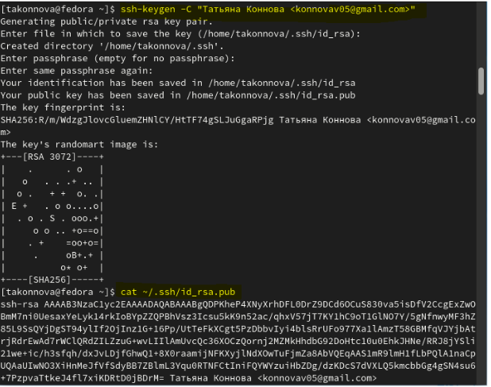
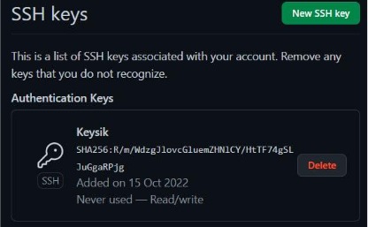
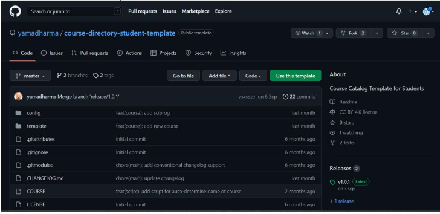
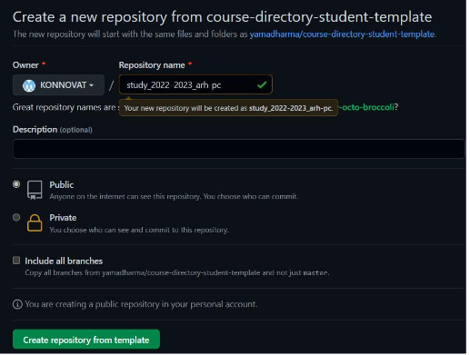
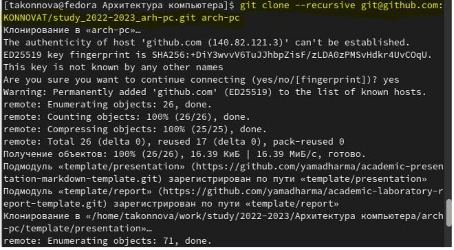

---
## Front matter
title: "Первоначальна настройка git."
subtitle: "НПИбд-01-22"
author: "Коннова Татьяна Алексеевна"

## Generic otions
lang: ru-RU
toc-title: "Содержание"

## Bibliography
bibliography: bib/cite.bib
csl: pandoc/csl/gost-r-7-0-5-2008-numeric.csl

## Pdf output format
toc: true # Table of contents
toc-depth: 2
lof: true # List of figures
lot: true # List of tables
fontsize: 12pt
linestretch: 1.5
papersize: a4
documentclass: scrreprt
## I18n polyglossia
polyglossia-lang:
  name: russian
  options:
	- spelling=modern
	- babelshorthands=true
polyglossia-otherlangs:
  name: english
## I18n babel
babel-lang: russian
babel-otherlangs: english
## Fonts
mainfont: PT Serif
romanfont: PT Serif
sansfont: PT Sans
monofont: PT Mono
mainfontoptions: Ligatures=TeX
romanfontoptions: Ligatures=TeX
sansfontoptions: Ligatures=TeX,Scale=MatchLowercase
monofontoptions: Scale=MatchLowercase,Scale=0.9
## Biblatex
biblatex: true
biblio-style: "gost-numeric"
biblatexoptions:
  - parentracker=true
  - backend=biber
  - hyperref=auto
  - language=auto
  - autolang=other*
  - citestyle=gost-numeric
## Pandoc-crossref LaTeX customization
figureTitle: "Рис."
tableTitle: "Таблица"
listingTitle: "Листинг"
lofTitle: "Список иллюстраций"
lolTitle: "Листинги"
## Misc options
indent: true
header-includes:
  - \usepackage{indentfirst}
  - \usepackage{float} # keep figures where there are in the text
  - \floatplacement{figure}{H} # keep figures where there are in the text
---

# Цель работы

    Изучить идеологию и применение средств контроля версий.
    
    Освоить умения по работе с git.
    

# Задание

    Изучить идеологию и применение средств контроля версий.
    
    Освоить умения по работе с git.
    

# Выполнение лабораторной работы

Существует несколько доступных серверов репозиториев с возможностью

бесплатного размещения данных. Например, http://bitbucket.org/, https://gith

ub.com/ и https://gitflic.ru. Для выполнения лабораторных работ воспользуюсь Github.

Создала учётную запись на сайте https://github.com/ и заполнила основные

данные.
 (рис. [-@fig:001]) 
 

{ #fig:001 width=70% }

Сначала сделаем предварительную конфигурацию git. Открываем терминал и

введём следующие команды, указав мое имя и email как владельца репозитория:

git config --global user.name “Tatyana Konnova” 

git config --global user.email "<konnovav05@gmail.com>" 

Настроим utf-8 в выводе сообщений git:
git config --global core.quotepath false 

Зададим имя начальной ветки (будем называть её master):

git config --global init.defaultBranch master 

Параметр autocrlf:

git config --global core.autocrlf input 

Параметр safecrlf:

git config --global core.safecrlf warn   (рис. [-@fig:002]) 

{ #fig:002 width=70% }

Создание SSH ключа
Для последующей идентификации пользователя на сервере репозиториев

необходимо сгенерировать пару ключей (приватный и открытый):

ssh-keygen -C "Татьяна Коннова konnovav05@gmail.com" Рис. 3

Ключи сохраняться в каталоге ~/.ssh/.

Далее необходимо загрузить сгенерированный открытый ключ. Для этого зайдем на

сайт http://github.org/ под своей учётной записью и перейдем в меню Settings . После этого

выберем в боковом меню SSH and GPG keys и нажмем кнопку New SSH key .

Скопировав из локальной консоли ключ в буфер обмена

cat ~/.ssh/id_rsa.pub (рис. [-@fig:003]) 

{ #fig:003 width=70% }
 
Вставляем ключ в появившееся на сайте поле и указываем для ключа имя (Keysik) (рис. [-@fig:004]) 

{ #fig:004 width=70% }

ознание рабочего пространства и репозитория курса на
основе шаблона
При выполнении лабораторных работ следует придерживаться структуры
рабочего пространства. Рабочее пространство по предмету располагается в
следующей иерархии:
~/work/study/
└── <учебный год>/
...
• Каталог для лабораторных работ имеет вид labs.

• Каталоги для лабораторных работ имеют вид lab<номер>, например: lab01,

lab02 и т.д.
Название проекта на хостинге git имеет вид: study_<учебный год>_<код

предмета>
Например, для 2022–2023 учебного года и предмета ... (код

предмета arch-pc) название проекта примет следующий вид:
study_2022–2023...

Откроем терминал и создадим каталог для предмета ....:

mkdir -p ~/work/study/2022-2023/....(рис. [-@fig:005])

{ #fig:005 width=70% }

Созdание репозитория курса на основе шаблона

Репозиторий на основе шаблона можно создать через web-интерфейс github.

Перейдём на станицу репозитория с шаблоном курса https://github.com/yamadharma/course-directory-student-template.(рис. [-@fig:006])

{ #fig:006 width=70% }

Далее выберем Use this template.
В открывшемся окне задаем имя репозитория (Repository name)
5
study_2022–2023_....  и создаем репозиторий (рис. [-@fig:007])

{ #fig:007 width=70% }

Откроем терминал и перейдём в каталог курса:
cd ~/work/study/2022-2023/"Архитектура компьютера"(рис. [-@fig:008])

{ #fig:008 width=70% }

Клонируем созданный репозиторий:
git clone –recursive git@github.com:KONNOVAT/study_2022–2023_arh-pc.git arch-pc(рис. [-@fig:009]) 

{ #fig:009 width=70% }   

Настройка каталога курса

Перейдем в каталог курса:

cd ~/work/study/2022-2023/...
Удаляем лишние файлы:

rm package.json 

Создаем необходимые каталоги:

echo arch-pc > COURSE 

make 

Отправляем файлы на сервер:

git add . 
(рис. [-@fig:010])

{ #fig:010 width=70% }

git commit -am 'feat(main): make course structure' (рис. [-@fig:012])

{ #fig:012 width=70% }

git push  (рис. [-@fig:013])

{ #fig:013 width=70% }

Проверяем правильность создания иерархии рабочего пространства в локальном
репозитории и на странице github, проверила, изменения вступили в силу. (рис. [-@fig:014])

{ #fig:014 width=70% }  

## Самостоятельная работа 

1) Что такое системы контроля версий (VCS) и для решения каких задач они предназначаются?

Системы контроля версий (VCS) — это программные инструменты, которые помогают управлять изменениями исходного кода с течением времени. Они позволяют разработчикам отслеживать изменения, возвращаться к предыдущим версиям и сотрудничать с другими разработчиками. Они также позволяют хранить исходный код и делиться им с другими.

2) Объясните следующие понятия VCS и их отношения: хранилище, commit, история, рабочая копия.
Хранилище — это место, где хранится и управляется исходный код. Это основная область хранения для всех версий проекта.
Commit — это сохраненная версия проекта. Он представляет собой снимок проекта в определенный момент времени. Коммиты используются для отслеживания изменений кода с течением времени.
История: история проекта — это запись всех коммитов, сделанных в репозиторий. Он показывает, как проект развивался с течением времени и какие изменения были внесены разработчиками.
Рабочая копия — это локальная копия репозитория. Она используется разработчиками для внесения изменений в код, не затрагивая основной репозиторий. Затем изменения могут быть зафиксированы в репозитории, когда они будут готовы.

3) Что представляют собой и чем отличаются централизованные и децентрализованные VCS? Приведите примеры VCS каждого вида.

Централизованные системы контроля версий (CVCS) — это системы, в которых все файлы и изменения хранятся на одном сервере. Все пользователи получают доступ к одному и тому же серверу для фиксации, отправки и получения изменений. Примеры CVCS включают Subversion (SVN) и Perforce.
Децентрализованные системы контроля версий (DVCS) — это системы, в которых у каждого пользователя есть собственная локальная копия репозитория. Изменения можно зафиксировать в локальном репозитории, а затем отправить в репозитории других пользователей. Примеры DVCS включают Git и Mercurial.

4) Опишите действия с VCS при единоличной работе с хранилищем.

При единоличной работе с системой контроля версий пользователь может фиксировать изменения в своем локальном репозитории. Это включает в себя добавление новых файлов, редактирование существующих файлов и удаление файлов. Затем пользователь может отправить эти изменения в центральный репозиторий, где они будут храниться для доступа других пользователей. Пользователь также может получать изменения из центрального репозитория, который будет обновлять их локальный репозиторий последними изменениями, сделанными другими пользователями.

5) Опишите порядок работы с общим хранилищем VCS.

1. Создаем локальный репозиторий. Основным шагом к работе с системой контроля версий является создание локального репозитория либо путем клонирования существующего репозитория с удаленного сервера, либо путем создания нового репозитория с нуля.
2. Вносим изменения. После создания локального репозитория пользователи могут вносить изменения в свои локальные файлы: добавление новых файлов, редактирование существующих файлов и удаление файлов.
3. Фиксируем изменения: после внесения изменений в локальный репозиторий пользователи могут зафиксировать свои изменения. Мы сохраняем изменения в локальном репозитории и позволит их отслеживать.
4. Нужно отправить изменения: после внесения изменений в локальный репозиторий пользователи могут отправить эти изменения в центральный репозиторий. Это сохранит изменения, чтобы другие могли получить доступ и обновить свои локальные репозитории последними изменениями.
5. Нужно извлечь изменения: пользователи также могут извлекать изменения из центрального репозитория. Это обновит их локальный репозиторий последними изменениями, внесенными другими пользователями.
6) Каковы основные задачи, решаемые инструментальным средством git?
Контроль 
версий: Git позволяет пользователям отслеживать изменения в своем коде с течением времени и при необходимости возвращаться к предыдущим версиям.
Ветвление
Git позволяет пользователям создавать несколько веток проекта для разных целей, таких как
разработка, тестирование и производство.
Слияние
Git позволяет пользователям объединять разные ветки вместе.
Совместная работа: Git упрощает совместную работу нескольких пользователей над проектом, позволяя им отправлять и извлекать изменения из репозиториев друг друга.
Безопасность. Git обеспечивает безопасный способ хранения исходного кода и управления им с помощью шифрования и аутентификации.
7) Назовите и дайте краткую характеристику командам git.
git push: отправляет изменения в удаленный репозиторий. git pull: извлекает изменения из удаленного репозитория.
git status: Проверяет текущий статус репозитория. git init: инициализирует новый локальный репозиторий Git.git clone: клонирует существующий репозиторий из удаленного источника.git add: Добавляет файлы в промежуточную область для фиксации.
 git commit: фиксирует изменения в локальном репозитории.

git branch: создает ветки в репозитории и управляет ими.
8) Приведите примеры использования при работе с локальным и удалённым репозиториями.
Локальный репозиторий:
 git add: Добавляет файлы в промежуточную область для фиксации.
git commit: фиксирует изменения в локальном репозитории.
git status: Проверяет текущий статус репозитория.
git init: инициализирует новый локальный репозиторий Git. ветка git: создает ветки в репозитории и управляет ими.
Удаленный репозиторий:
 git clone: клонирует существующий репозиторий из удаленного источника. git push: отправляет изменения в удаленный репозиторий. git pull: извлекает изменения из удаленного репозитория.
9) Что такое и зачем могут быть нужны ветви (branches)?
Разделение проектов
Позволяют разработчикам работать над различными функциями или исправлениями ошибок, не затрагивая основной код. Ветки также можно использовать для экспериментов с новыми идеями или тестирования новых функций, не влияя на основной проект. Это упрощает отслеживание изменений и сотрудничество с другими разработчиками.

10) Как и зачем можно игнорировать некоторые файлы при commit?
 .gitignore. Эта команда указывает, какие файлы следует игнорировать при фиксации изменений. Это может быть полезно для игнорирования файлов, которые не нужно отслеживать, таких как временные файлы или файлы конфигурации. Его также можно использовать для предотвращения случайной фиксации конфиденциальной информации, такой как пароли.

# Выводы
Благодаря данной лабораторной работе я приобрела практические навыки работы со
средствами контроля версий git, изучила идеологию и применение данных средств
::: {#refs}
:::
