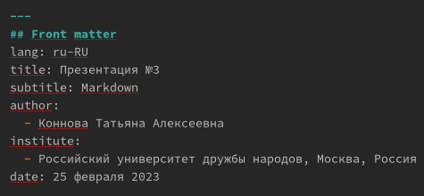

---
## Front matter
lang: ru-RU
title: Презентация по Лабораторной работе №3
subtitle: Markdown
author:
  - Коннова Татьяна Алексеевна
institute:
  - Российский университет дружбы народов, Москва, Россия
date: 25 февраля 2023

## i18n babel
babel-lang: russian
babel-otherlangs: english

## Formatting pdf
toc: false
toc-title: Содержание
slide_level: 2
aspectratio: 169
section-titles: true
theme: metropolis
header-includes:
 - \metroset{progressbar=frametitle,sectionpage=progressbar,numbering=fraction}
 - '\makeatletter'
 - '\beamer@ignorenonframefalse'
 - '\makeatother'
---

# Вступление

## Цель работы

- Научиться оформлять отчёты с помощью легковесного языка разметки Markdown

## Задачи

- Сделать отчёт по предыдущей лабораторной работе в формате Markdown.
- В качестве отчёта предоставить отчёты в 3 форматах: pdf, docx и md (в архиве,
поскольку он должен содержать скриншоты, Makefile и т.д.)

# Ход работы
## Подготовка вводной части отчёта
Отчет о выполнении лабораторной работы содержит, как правило,
 содержание, заголовки, скриншоты работы с подписями
 
 
 { width=60% }
 
 
## Работа над лабораторной работой №2
 На примере лабораторной работы №2 мы научились создавать формат Markdown
 
  { width=70% }
  
  
## Заключительная часть подготовки отчета на примере лабораторной №2 в формате Markdown

Делаем выводы, перед этим отвечая на вопросы из самостоятельной работы

 { width=70% }
 
## Объединениние трех форматов в один zip-file
 
Делаем архив, содержащий форматы docx, pdf, md посредством сжатия.
 
 
 
 
 { width=25% }
 
 
# Подведение итогов

В следующем разделе мы должны прописать выводы из проделанной работы:

## Вывод:
- Научились оформлять отчёты с помощью легковесного языка разметки Markdownл 

# 

Спасибо за внимание!
